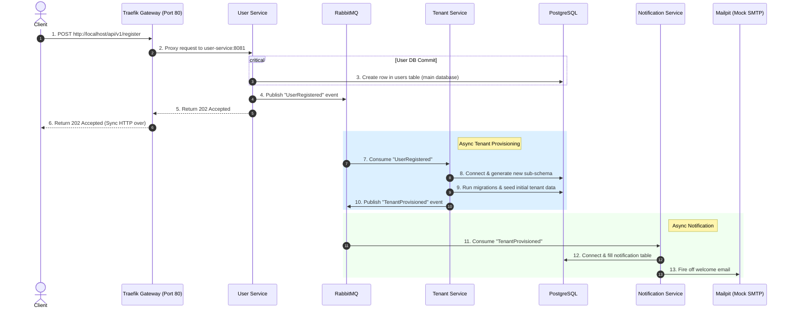

# Broker API Workspace (Polyrepo Simulation)

This workspace is structured as a collection of independent, unlinked directories to simulate a **Polyrepo** architecture. Each directory operates as a standalone project with equal status, running on a shared Docker network.

---

## 1. Network & Orchestration Flow

Each folder represents an independent project. To connect them, the `broker/` infrastructure service spins up PostgreSQL, RabbitMQ, Mailpit, and Traefik Gateway on a shared external Docker network called `broker-network`.

```mermaid
graph TD
    subgraph broker/ Folder (Infrastructure & Compose)
        TR[Traefik Gateway (Port 80)]
        DB[(PostgreSQL)]
        MQ[RabbitMQ]
        SMTP[Mailpit]
    end

    subgraph Independent Service Folders (Same directory level)
        US[user-service]
        TS[tenant-service]
        NS[notification-service]
    end

    TR -->|Proxy /api/v1/register| US

    US -->|Port 5672| MQ
    US -->|Port 5432| DB
    
    TS -->|Port 5672| MQ
    TS -->|Port 5432| DB

    NS -->|Port 5672| MQ
    NS -->|Port 5432| DB
    NS -->|Port 1025| SMTP

    classDef infra fill:#f9f,stroke:#333,stroke-width:2px;
    classDef service fill:#bbf,stroke:#333,stroke-width:2px;
    class DB,MQ,SMTP,TR infra;
    class US,TS,NS service;
```

---

## 2. Dynamic Workflow & Events Sequence



---

## 3. RabbitMQ Event Design

### Exchange: `company.events` (Topic Exchange)

| Event Name | Routing Key | Publisher | Subscriber(s) | Payload Example |
| :--- | :--- | :--- | :--- | :--- |
| **User Registered** | `user.registered` | User Service | Tenant Service | `{"user_id": 123}` |
| **Tenant Provisioned** | `tenant.provisioned` | Tenant Service | Notification Service | `{"tenant_id": "abc-123", "user_id": 123}` |

---

## 4. Directory Structure

All projects live in the `/broker-api` workspace but operate as **equal, decoupled entities**:

```text
broker-api/
├── README.md                     # Architecture documentation
├── ROADMAP.md                    # Actionable execution plan & checklist
│
├── broker/                       # Infrastructure & Orchestration (Simulating Infra Repo)
│   ├── init.sql                  # Base DDL for public schema (users, tenants, notifications)
│   └── docker-compose.yml        # Configures Postgres, RabbitMQ, Mailpit, Traefik, broker-network
│
├── user-service/                 # Standalone Go REST API (Controller-Service-Repository Pattern)
│   ├── cmd/main.go               # Port 8081 - HTTP REST API Entrypoint & DI Wireup
│   ├── internal/
│   │   ├── utils/                # Pure Utilities (slug.go)
│   │   ├── infrastructure/       # Postgres & RabbitMQ Drivers (postgres/client.go, rabbitmq/client.go)
│   │   ├── repository/           # Data Access Layer (user_repository.go, tenant_repository.go)
│   │   ├── service/              # Business Logic & Orchestration (user_service.go)
│   │   ├── publisher/            # Outbound Event Publisher (user_publisher.go)
│   │   └── handler/              # HTTP Controllers & Response Helpers (register.go, response.go)
│   └── Dockerfile
│
├── tenant-service/               # Standalone Go Async Worker (Controller-Service-Repository Pattern)
│   ├── cmd/main.go               # Background Async Worker Entrypoint
│   ├── internal/
│   │   ├── utils/                # Pure Utilities (slug.go)
│   │   ├── infrastructure/       # Postgres & RabbitMQ Drivers
│   │   ├── repository/           # Provisioner Data Access Layer (provisioner_repository.go)
│   │   ├── publisher/            # Outbound Event Publisher (tenant_publisher.go)
│   │   ├── service/              # Provisioner Business Logic (tenant_service.go)
│   │   └── consumer/             # Inbound Transport Consumer (user_registered_consumer.go)
│   ├── migrations/               # Schema-per-tenant migration SQL templates
│   └── Dockerfile
│
├── notification-service/         # Standalone Go Async Worker (Controller-Service-Repository Pattern)
│   ├── cmd/main.go               # Background Async Worker Entrypoint
│   ├── internal/
│   │   ├── infrastructure/       # Postgres & RabbitMQ Drivers
│   │   ├── mailer/               # SMTP Mailer Driver (Mailpit)
│   │   ├── repository/           # Notification Audit Repository (notification_repository.go)
│   │   ├── service/              # Notification Business Logic (notification_service.go)
│   │   └── consumer/             # Inbound Transport Consumer (tenant_provisioned_consumer.go)
│   └── Dockerfile
│
└── e2e-tests/                    # Automated E2E Test Suite (gofakeit integration)
    ├── go.mod
    └── register_e2e_test.go      # End-to-end integration test suite
```

---

## 5. Port Map & Dashboards

| Component | Container | Port | Web Dashboard / Endpoint |
| :--- | :--- | :--- | :--- |
| **Traefik Gateway** | `traefik` | `8000` | Entry point for API requests (`http://localhost:8000/api/v1/register`) |
| **Traefik Dashboard** | `traefik` | `8080` | `http://localhost:8080` |
| **PostgreSQL** | `postgres` | `5432` | `localhost:5432` |
| **RabbitMQ AMQP** | `rabbitmq` | `5672` | `localhost:5672` |
| **RabbitMQ Management** | `rabbitmq` | `15672` | `http://localhost:15672` (guest / guest) |
| **Mailpit SMTP** | `mailpit` | `1025` | `localhost:1025` |
| **Mailpit Dashboard** | `mailpit` | `8025` | `http://localhost:8025` |

---

## 6. How to Run & Stop the Application

### 🚀 Starting the Infrastructure & Services

1. **Start Shared Infrastructure (`broker/`)**:
   ```bash
   cd broker && docker compose up -d
   ```
   *Spuns up PostgreSQL, RabbitMQ, Mailpit, Traefik Gateway, and creates `broker-network`.*

2. **Start Microservices**:
   Run each service in a separate terminal or sequentially:
   ```bash
   # Start User Service
   cd user-service && docker compose up -d --build

   # Start Tenant Service (Background Worker)
   cd ../tenant-service && docker compose up -d --build

   # Start Notification Service (Background Worker)
   cd ../notification-service && docker compose up -d --build
   ```

3. **Run Automated E2E Tests**:
   ```bash
   cd e2e-tests && CGO_ENABLED=0 go test -v ./...
   ```

---

### 🛑 Stopping All Services

To shut down all containers and clean up the shared network, run:

```bash
(cd notification-service && docker compose down) && \
(cd tenant-service && docker compose down) && \
(cd user-service && docker compose down) && \
(cd broker && docker compose down)
```

---

### 🧹 Fresh Start / Reset Database Completely

PostgreSQL persists database state in a named Docker volume (`broker_postgres_data`). Standard `docker compose down` leaves the database volume intact.

To **wipe the database completely** and start fresh from scratch:

```bash
# 1. Stop all microservices
(cd notification-service && docker compose down) && \
(cd tenant-service && docker compose down) && \
(cd user-service && docker compose down)

# 2. Wipe infrastructure and persistent volume (-v flag)
cd broker && docker compose down -v

# 3. Start fresh infrastructure (auto-recreates DB & runs init.sql)
cd broker && docker compose up -d
```

---

## 7. Connecting DataGrip to the Database

Follow these steps to connect JetBrains **DataGrip** (or DBeaver / TablePlus) to the multi-tenant PostgreSQL database:

### 1. New Data Source Configuration
In DataGrip:
1. Click **+** (New Data Source) ➔ **PostgreSQL**.
2. Fill in the connection settings:
   - **Host**: `localhost`
   - **Port**: `5432`
   - **User**: `postgres`
   - **Password**: `postgres`
   - **Database**: `broker_db`
   - **URL**: `jdbc:postgresql://localhost:5432/broker_db`

### 2. Enable Multi-Tenant Schemas (Crucial Step!)
Since `tenant-service` dynamically creates schema-per-tenant (`tenant_<slug>`):
1. In the Data Source properties window, switch to the **Schemas** tab.
2. Check **All schemas** (or select `public` and `tenant_*` patterns).
3. Click **Test Connection**, then click **Apply** and **OK**.

### 3. Exploring Tables in DataGrip
After connecting:
- `public` schema contains:
  - `public.users`: Global user accounts with meaningful IDs (e.g. `usr_a1b8d37e47684bd2`, `email`, `name`).
  - `public.tenants`: Global tenant registry (`id` e.g. `tenant_acme`, `name`, `slug`, `owner_id` FK to `public.users.id`).
  - `public.notifications`: Notification audit logs (`id`, `user_id`, `tenant_id`, `recipient_email`, `status`).
- `tenant_<slug>` dynamic schemas (e.g. `tenant_acme`, `tenant_stark`, `tenant_wayne`) contain:
  - `tenant_settings`: Key-value configuration (`plan`, `status`).
  - `tenant_members`: User roles and full member profile (`user_id`, `name`, `email`, `role`).

